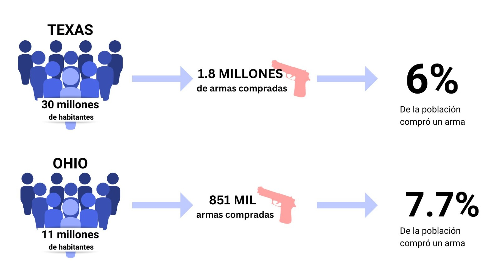

# Visualizaciones 
Los scripts de cada gráfico estan en la carpeta correspondiente.

## Visualizaciones Villalobos 

1. Gráfico que muestra el aumento de ventas de armas a nivel país por año y que demuestra un alza considerable el año 2020. 

1. Gráfico que muestra la cantidad de tiroteos por Estado en otoño del 2021, cuando se produjo un alza considerable en la cantidad de tiroteos escolares. Podemos ver que Ohio fue el Estado que más incidentes tuvo en el otoño post pandemia. 

1. Tabla con mapa de calor que muestra la cantidad de tiroteos escolares ocurridos en otoño en cada estado, en los últimos 6 años. Aquí podemos notar con cifras el alza en la cantidad de incidentes y los Estados que más incidentes tuvieron. En esta tabla sobre todo podemos notar que el Estado de Ohio, antes de la pandemia, solo tenia como máximo 2 tiroteos escolares durante el otoño. 

1. Tabla que muestra los 10 estados que más compraron armas durante el 2020, Ohio está entre los 5 que más lo hicieron, sin embargo, no es el primero, es el 5to, y fue el que más tiroteos escolares tuvo en otoño con el retorno a clases. Para explicar que, si existe una concordancia con la mayor adquisición de armas y la cantidad de tiroteos, realicé una gráfica adicional para complementar y explicar lo anterior:

La realicé a través de canvas y utilice datos de nics-latest.csv para explicar que aunque en la primera tabla Ohio este por debajo de Texas en la compra de armas, es meramente porque tiene menos población. Sin embargo si consideramos que se compró un arma por persona, podemos notar que proporcional a su población total, en Ohio se compraron más armas que en Texas, incidiendo en la mayor disponibilidad de armas y en el aumento de la cantidad de tiroteos escolares.

## Visualizaciones Fresno

1. Gráfico de líneas que muestra, como se puede ver en la leyenda, la cantidad de victimas heridas, fatales y totales por causa de tiroteos escolares en los últimos 23 años. 

1. A continuación, y para complementar el primer gráfico, elaboré un gráfico de barras que muestra la cantidad de incidentes cada año, desde el 2000 hasta el presente. 

1. A traves de Flourish generé un mapa de calor de Estados Unidos para visualizar cuáles son los estados con mayor cantidad de tiroteos desde el 2000. El mapa es interactivo ya que al pasar el cursor por encima te indica el nombre del estado y la cantidad exacta de incidentes. 

1. Por último, y también con la herramienta de flourish, elaboré un gráfico de linea de acuerdo a la cantidad de tiroteos por estación del año (verano, primavera, otoño e invierno). Este gráfico nos permite observar un claro incremento de los incidentes en otoño de 2021. Este gráfico también es interactivo. 

## Visualizaciones Piza 

1. 1. Con Flourish generé un mapa de de Estados Unidos para visualizar cuál es el color político de cada estado, siendo azul los demócratas, rojo los republicanos y morados los estados "visagra" o que tiended a cmabiar su color politico en cada elección. 

